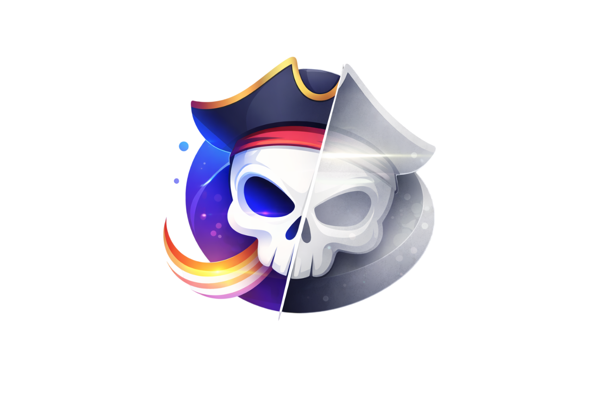

<div align="center">
  

  <h1>Skeleton Generator</h1>
  <p><strong>Convierte cualquier SVG en un skeleton loader animado, listo para producción.</strong></p>

  <p>
    
    
    
    
  </p>

  <p>
    
    
    
    
    
  </p>
</div>

---

## ¿Qué es?

**Skeleton Generator** es una herramienta web que toma un archivo SVG (logo, ícono, ilustración) y genera automáticamente un componente **skeleton loader animado** listo para copiar y pegar en tu proyecto.

Soporta exportación para **5 frameworks**: React, Angular, Vue, React Native y Flutter. Las animaciones se implementan con **SMIL `animateTransform`** embebido en el propio SVG, sin dependencias de CSS externas.

---

## Características

- **Sube tu SVG** arrastrando o seleccionando el archivo
- **Dos algoritmos de procesamiento:**
  - `Preciso` — conserva todas las formas del SVG original
  - `Silueta` — extrae el contorno exterior con curvas suaves (ideal para SVGs complejos)
- **8 tipos de animación** con vista previa en tiempo real
- **Control de duración** ajustable de 0.5s a 3.0s
- **Vista previa del skeleton** sincronizada con el tema de la app
- **Exportación por framework** con código listo para producción
- **Copiar al portapapeles** o descargar el archivo directamente
- **Tema claro / oscuro** con persistencia en `localStorage`
- **Internacionalización** Español / Inglés, autodetectado desde el navegador

---

## Animaciones disponibles

| ID | Descripción |
|----|-------------|
| `left-right` | Shimmer horizontal clásico (izquierda → derecha) |
| `right-left` | Shimmer horizontal inverso |
| `top-bottom` | Shimmer vertical descendente |
| `bottom-top` | Shimmer vertical ascendente |
| `diagonal` | Shimmer en diagonal |
| `radial` | Brillo desde el centro hacia afuera |
| `pulse` | Opacidad pulsante |
| `wave` | Escala pulsante suave |

---

## Frameworks de exportación

| Framework | Archivo generado | Implementación |
|-----------|-----------------|----------------|
| **React** | `LogoSkeleton.tsx` | Componente funcional con SVG inline |
| **Angular** | `logo-skeleton.component.ts` | Componente standalone con `@Component` |
| **Vue** | `LogoSkeleton.vue` | Single File Component (`<template>` + `<script setup>`) |
| **React Native** | `LogoSkeleton.tsx` | `SvgXml` de `react-native-svg` |
| **Flutter** | `logo_skeleton.dart` | Widget `SvgPicture` de `flutter_svg` |

---

## Tech Stack

| Capa | Tecnología |
|------|-----------|
| Framework | [Next.js 16](https://nextjs.org) (App Router) |
| UI | [React 19](https://react.dev) |
| Estilos | [Tailwind CSS v4](https://tailwindcss.com) |
| Tipos | TypeScript 5 |
| Iconos | [@iconify/react](https://iconify.design) — sets `lucide:` y `logos:` |
| Animaciones SVG | SMIL `animateTransform` (nativo, sin JS) |
| Estado | React Context API |
| Persistencia | `localStorage` (tema e idioma) |

---

## Estructura del proyecto

```
my-app/
├── app/
│   ├── layout.tsx          # Root layout con ThemeProvider + LanguageProvider
│   ├── page.tsx            # Página principal
│   └── globals.css         # Tailwind v4 + keyframes de animación
│
├── modules/skeleton/
│   ├── components/
│   │   ├── Header.tsx          # Header con logo, título, selector de idioma y tema
│   │   ├── ThemeSwitch.tsx     # Toggle claro/oscuro
│   │   ├── LanguageSelector.tsx# Selector ES / EN
│   │   ├── Uploader.tsx        # Dropzone + selector de algoritmo
│   │   ├── PreviewPanel.tsx    # Vista previa + selector de animación + slider
│   │   ├── ExportModal.tsx     # Modal de exportación
│   │   ├── ExportPanel.tsx     # Tabs de framework + CodeBlock
│   │   └── CodeBlock.tsx       # Visor de código con copiar/descargar
│   │
│   ├── container/
│   │   └── skeleton-container.tsx  # Orquestador principal de estado
│   │
│   ├── context/
│   │   ├── theme-context.tsx       # ThemeProvider + useAppTheme
│   │   └── language-context.tsx    # LanguageProvider + useTranslation
│   │
│   ├── i18n/
│   │   ├── types.ts    # Interface Translations
│   │   ├── es.ts       # Traducciones en español
│   │   ├── en.ts       # Traducciones en inglés
│   │   └── index.ts    # Barrel export
│   │
│   ├── types/
│   │   └── skeleton.ts     # Tipos, constantes y opciones
│   │
│   └── utils/
│       ├── svgParser.ts    # Parseado de SVG y generación de skeleton
│       └── generators.ts   # Generadores de código por framework
│
└── assets/
    ├── logo.png
    └── logo.svg
```

---

## Instalación y uso

### Requisitos

- Node.js 18+
- npm / yarn / pnpm

### Instalar dependencias

```bash
npm install
```

### Modo desarrollo

```bash
npm run dev
# → http://localhost:4000
```

### Build de producción

```bash
npm run build
npm run start
```

---

## Cómo usar la app

1. **Sube tu SVG** — arrastra el archivo al dropzone o haz clic en "selecciona un archivo"
2. **Elige el algoritmo** — `Preciso` para logos simples, `Silueta` para SVGs complejos
3. **Selecciona la animación** — elige entre los 8 tipos disponibles en el desplegable
4. **Ajusta la duración** — mueve el slider entre 0.5s y 3.0s
5. **Previsualiza** — el skeleton animado se actualiza en tiempo real
6. **Exporta** — haz clic en "Exportar código", elige tu framework y copia o descarga el archivo

---

## Notas técnicas

- Las animaciones SMIL están soportadas en **Chrome, Firefox y Edge**. Safari tiene soporte limitado de SMIL; para React Native y Flutter el código generado usa las APIs nativas de cada plataforma.
- El tema oscuro usa la directiva `@custom-variant dark` de Tailwind v4 con modo basado en clase (`.dark` en `<html>`).
- El idioma se autodetecta con `navigator.language` y se persiste en `localStorage` bajo la clave `app-language`.

---

<div align="center">
  <sub>Hecho con Next.js · React · Tailwind CSS · TypeScript</sub>
</div>
